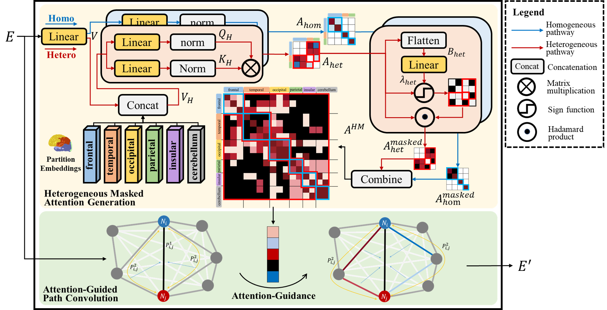

# :sparkles: HM-AGPC

[MICCAI 2025]The official code for Heterogeneous Masked Attention-Guided Path Convolution for Functional Brain Network Analysis

Brain functional connectivity analysis plays a crucial role in the computer-aided diagnosis of brain disorders. The brain organization is a heterogeneous structure with distinct functional divisions. However, current heterogeneous algorithms often introduce excessive parameters while characterizing heterogeneous relationships, leading to redundancy and overfitting. To address these issues, we propose the Heterogeneous Masked Attention-Guided Path Convolution (HM-AGPC) for functional brain network analysis. The HM-AGPC introduces a heterogeneous masked attention generation mechanism that preserves valuableheterogeneous relationships while minimizing redundant interactions and highlighting crucial functional connections. Moreover, the framework in corporates an attention-guided path convolution strategy, which leverages attention weights to guide the convolution kernel in focusing on the most salient features and pathways. This approach improves model performance without directly introducing extra parameters, thereby enhances feature learning efficiency. We evaluate HM-AGPC on the ABIDE dataset using ten-fold cross-validation, where it demonstrates superior performance in disease diagnosis task compared to state-of-the-art methods. Additionally, the framework demonstrates high interpretability, making it a promising tool for computer-aided diagnosis and the identification of potential biomarkers.

The overview of HM-AGPC. Step 1 (blue): Functional Brain Network Construction. Step 2 (orange): Masked Attention Generation and Path Convolution, including our two key components: Heterogeneous Masked Attention Generation and Attention Guided Path Convolution. Step 3 (red): Readout and Prediction.

The diagram of Heterogeneous Masked Attention Generation (yellow) and  Attention-Guided Path Convolution (green). The heterogeneous and homogeneous pathways are marked with red and blue respectively.

## Instructions
HM_AGPC is our main model.

self.node_list is the partition prior for AAL atlas, should be changed based on the chosen atlas and prior partitions.

train_demo.py provide a training demo. train_data and test_data should be changed to real-world datas.

ABIDE dataset can be downloaded from [here](https://fcon_1000.projects.nitrc.org/indi/abide/abide_I.html). 

## **Code environment**
python 3.9

pytorch 2.0.1
